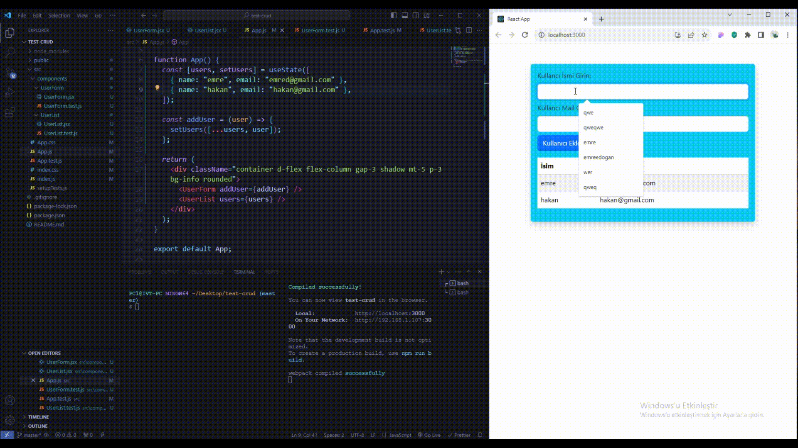

## crud-test

- Bu uygulama, şeylerin yolunda gittiğinden ve uygulamanın düzgün çalıştığından emin olmak için testlerle güçlendirildi. Testler, uygulamanın farklı parçalarını tek tek kontrol etmek gibidir. Yani uygulama bir şeyi doğru yapmıyorsa, testler bu sorunu anlamamıza yardımcı olur. Sonuçta, kodun ne kadar güçlü olduğunu görmemizi sağlar ve yeni şeyler eklerken ya da kodu değiştirirken her şey yolunda mı diye bakmamıza yardımcı olur.

